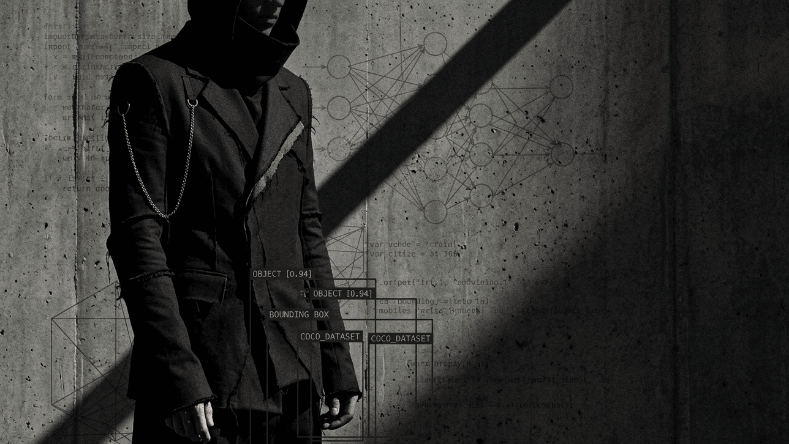

  

---

<h3 align="center">Kirill Ivanov · Moscow · RTU MIREA</h3>

---

<h3 align="center">Achievements</h3>

| Year | Challenge | My Task | My Role | Result |
|------|-----------|---------|---------|--------|
| 2025 | IV International Essay Contest "Social Networks in Youth Life" | Wrote an essay in English on social media: unifying space vs digital addiction | Solo participant | 1st Degree Diploma |
| 2026 | MTS True Tech Hack | Improving Lua code validation accuracy; added RAM constraints, worked with metrics, created C4 diagram | ML Engineer (team of 3) | Participant |
| 2026 | Find Yourself in Big Data | Reading personal data from images and videos, wrote main architecture, reducing false positives | Python Developer (team of 2) | Participant |
| 2026 | X5 growth gradient First‑Round | Turnover forecasting, data cleaning, feature generation | Data Scientist (team of 3) | Stage 1 successfully completed (Top 13 out of 350 teams) |
| 2026 | ArenaData | Created a data extractor, did the architecture, and was a team lead | Python Developer (team of 3) | Top 6 |

---

<h3 align="center">Tech Stack</h3>

<table align="center" width="100%">
  <tr><th width="25%">Area</th><th width="55%">Technologies</th><th width="20%">Level</th></tr>
  <tr><td><b>Languages & Environment</b></td><td>Python, C++, JavaScript, Linux, Bash</td><td>Python — Advanced C++/JS — Basics</td></tr>
  <tr><td><b>ML & Deep Learning</b></td><td>PyTorch, TensorFlow, Scikit-learn, XGBoost, LightGBM, CatBoost</td><td>PyTorch — Experienced Scikit-learn — Experienced TensorFlow — Working knowledge XGBoost/LightGBM/CatBoost — Confident</td></tr>
  <tr><td><b>Data & Visualization</b></td><td>Pandas, NumPy, Matplotlib, Seaborn, SQL</td><td>Pandas/NumPy — Advanced Matplotlib/Seaborn — Confident SQL — Basics</td></tr>
  <tr><td><b>MLOps & Tools</b></td><td>FastAPI, Docker, Git/GitHub, CI/CD, Linux admin</td><td>FastAPI — Confident Docker/Git — Basics CI/CD — basic understanding</td></tr>
  <tr><td><b>NLP · LLM · CV</b></td><td>LLM, RAG, OpenCV, Tesseract, Ollama, LangChain, Chroma/FAISS, Hugging Face, Transformers</td><td>LLM/RAG/OpenCV/Tesseract/Ollama — Confident / Hands‑on Hugging Face/Transformers — Working knowledge</td></tr>
  <tr><td><b>Mathematics</b></td><td>Mathematical Analysis, Linear Algebra, Probability & Statistics</td><td>Fundamentals / Growing</td></tr>
  <tr><td><b>Additional tools (in progress/learning)</b></td><td>Optuna, MLflow / W&B, Docker Compose, ONNX / TensorRT, Streamlit</td><td>Learning / Basic familiarity</td></tr>
</table>

---

<h3 align="center">Languages</h3>

  <b>Russian</b> (native) &nbsp;|&nbsp;
  <b>English</b> (fluent reading of technical documentation)

---

<h3 align="center">GitHub Statistics</h3>

  

  <picture>
    <source
      srcset="https://github-readme-activity-graph.vercel.app/graph?username=Kirill-code-ai&theme=github-dark&bg_color=0D1117&color=006400&line=006400&point=FFFFFF&area=true&hide_border=true&grid=0"
      media="(prefers-color-scheme: dark)"
    />
    <source
      srcset="https://github-readme-activity-graph.vercel.app/graph?username=Kirill-code-ai&theme=github-light&bg_color=ffffff&color=004d00&line=004d00&point=000000&area=true&hide_border=true&grid=0"
      media="(prefers-color-scheme: light), (prefers-color-scheme: no-preference)"
    />
    
  </picture>

  

  <i>“No NaNs in my motivation.”</i> 

